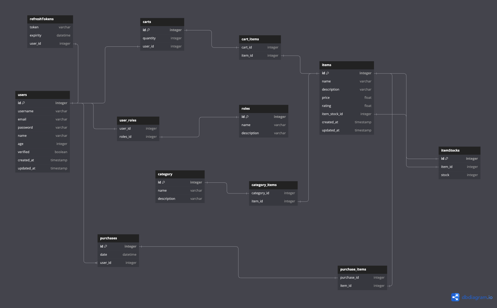

<p><a target="_blank" href="https://app.eraser.io/workspace/rf7uOfOOuweqmoum2hVB" id="edit-in-eraser-github-link"></a></p>

# E-Commerce Portfolio Project
## Table of Contents
- [This is a back-end nodejs project for an e-commerce website.](#this-is-a-back-end-nodejs-project-for-an-e-commerce-website)  
- [Current stage](#current-stage)  
- [Database](#database-schema)  
- [Project annotations](#project-annotations)  
- [Project libraries](#project-libraries)  
- [Useful Links](#usefull-links) 
## This is a back-end nodejs project for an e-commerce website.
 


### Current stage
- [ ] **To Do**:
- [ ] **In Progress**:
    - [ ] **Next Steps**: You’re welcome to expand your API beyond these project tasks and get creative! A future portfolio project will build on top of what you have built here, covering tasks for creating the client side of your e-commerce application. If you don’t want to wait that long, you can try building out a client for your API on your own!
- [x] **Done**:
    - [x] **Document the API**: Document the API you have built by adding and configuring Swagger to your project.
    - [x] **Set up order endpoint**: Add the logic for handling CRUD operations related to orders.
    - [x] **Set up checkout endpoint**: Add the logic for handling checkout. There is no need to actually try and charge somebody yet; charging will come in a later evolution of this project. For now, we will assume that all charges succeed for ease of development (still add in error handling to account for times it doesn’t).
    - [x] **Set up cart endpoint**: Add the logic for handling CRUD operations related to a user’s cart.
    - [x] **Set up user endpoints**: Add the logic for handling CRUD operations related to users and their accounts. (Implementing Refresh Tokens at the moment)
    - [x] **Set up product endpoints**: Add the logic for handling CRUD operations related to products.
    - [x] **Set up local login**: Add the logic for handling login using a username and password.
    - [x] **Plan API endpoints**: Plan the API endpoints that will be used in retrieving data from your database.
    - [x] **Set up user registration**: Add the logic for handling registration of new users.
    - [x] **Connect the app and database**: Set up your application to be able to interface with the PostgreSQL database.
    - [x] **Create PostgreSQL database and tables**: Create a PostgreSQL database and add the tables from your design.
    - [x] **Design the database**: Plan out the different types of data the application will track and how those pieces of data relate.
    - [x] **Set up an Express server**: Create a directory for your project and set up a basic Express server.
    - [x] **Set up version control**: Set up Git tracking in your directory and make sure to add and commit changes as you make them.
### Docker Compose
This project uses Nginx with reverse proxy
Redis as cache 

__First time ? Run Docker compose Build__

```shell
docker compose up --build
```
**Next time just run this:**

```shell
docker compose up -d
```
# Database Schema
Using [dbdiagram](https://dbdiagram.io/) 



```dbml
Table users {
  id integer [primary key]
  username varchar
  email varchar
  password varchar
  name varchar
  age integer
  verified boolean
  created_at timestamp
  updated_at timestamp
}

Table refreshTokens {
  token varchar
  expirity datetime
  user_id integer [ref: - users.id]
}

Table roles {
  id integer [pk]
  name varchar
  description varchar
}

Table user_roles {
  user_id integer [ref: - users.id]
  roles_id integer [ref: - roles.id]
}

Table carts {
  id integer [pk]
  user_id integer unique [ref: - users.id]
}

Table cart_items {
  cart_id integer  [ref: - carts.id]
  item_id integer [ref: - items.id]
  quantity integer
}


Table category {
  id integer [pk]
  name varchar
  description varchar
}

Table items {
  id integer [pk]
  name varchar
  description varchar
  price float
  rating float
  item_stock_id integer [ref: - itemStocks.id]
  created_at timestamp
  updated_at timestamp
}

Table category_items {
  category_id integer [ref: - category.id]
  item_id integer [ref: - items.id]
}

Table purchases {
  id integer [pk]
  date datetime
  user_id integer [ref: > users.id]
  cart_id integer [ref: < carts.id]
}

Table itemStocks {
  id integer [pk]
  item_id integer [ref: - items.id]
  stock integer

}
```
**Generated PostgresSQL Schema:**

```sql
CREATE TABLE "users" (
  "id" integer PRIMARY KEY,
  "username" varchar,
  "email" varchar,
  "password" varchar,
  "name" varchar,
  "age" integer,
  "verified" boolean,
  "created_at" timestamp,
  "updated_at" timestamp
);

CREATE TABLE "refreshTokens" (
  "token" varchar,
  "expirity" datetime,
  "user_id" integer
);

CREATE TABLE "roles" (
  "id" integer PRIMARY KEY,
  "name" varchar,
  "description" varchar
);

CREATE TABLE "user_roles" (
  "user_id" integer,
  "roles_id" integer
);

CREATE TABLE "carts" (
  "id" integer PRIMARY KEY,
  "quantity" integer,
  "user_id" integer UNIQUE
);

CREATE TABLE "cart_items" (
  "cart_id" integer,
  "item_id" integer
);

CREATE TABLE "category" (
  "id" integer PRIMARY KEY,
  "name" varchar,
  "description" varchar
);

CREATE TABLE "items" (
  "id" integer PRIMARY KEY,
  "name" varchar,
  "description" varchar,
  "price" float,
  "rating" float,
  "item_stock_id" integer,
  "created_at" timestamp,
  "updated_at" timestamp
);

CREATE TABLE "category_items" (
  "category_id" integer,
  "item_id" integer
);

CREATE TABLE "purchases" (
  "id" integer PRIMARY KEY,
  "date" datetime,
  "user_id" integer
);

CREATE TABLE "itemStocks" (
  "id" integer PRIMARY KEY,
  "item_id" integer,
  "stock" integer
);

CREATE TABLE "purchase_items" (
  "purchase_id" integer,
  "item_id" integer
);

ALTER TABLE "refreshTokens" ADD FOREIGN KEY ("user_id") REFERENCES "users" ("id");

ALTER TABLE "user_roles" ADD FOREIGN KEY ("user_id") REFERENCES "users" ("id");

ALTER TABLE "user_roles" ADD FOREIGN KEY ("roles_id") REFERENCES "roles" ("id");

ALTER TABLE "carts" ADD FOREIGN KEY ("user_id") REFERENCES "users" ("id");

ALTER TABLE "cart_items" ADD FOREIGN KEY ("cart_id") REFERENCES "carts" ("id");

ALTER TABLE "cart_items" ADD FOREIGN KEY ("item_id") REFERENCES "items" ("id");

ALTER TABLE "items" ADD FOREIGN KEY ("item_stock_id") REFERENCES "itemStocks" ("id");

ALTER TABLE "category_items" ADD FOREIGN KEY ("category_id") REFERENCES "category" ("id");

ALTER TABLE "category_items" ADD FOREIGN KEY ("item_id") REFERENCES "items" ("id");

ALTER TABLE "purchases" ADD FOREIGN KEY ("user_id") REFERENCES "users" ("id");

ALTER TABLE "itemStocks" ADD FOREIGN KEY ("item_id") REFERENCES "items" ("id");

ALTER TABLE "purchase_items" ADD FOREIGN KEY ("purchase_id") REFERENCES "purchases" ("id");

ALTER TABLE "purchase_items" ADD FOREIGN KEY ("item_id") REFERENCES "items" ("id");
```
_Note you should store your _`__.env__`_ file in the root of the backend project_

**Enviroment Setup Template**

```sh
NODE_ENV=
PORT=
DB_HOST=
DB_NAME=
DB_TEST=
DB_PASSWORD=
DB_USER=
DB_DRIVER=
JWT_SECRET=
REFRESH_SECRET=
JWT_EXPIRATION=
JWT_REFRESH_EXPIRATION=
JWT_VALIDATION_EXPIRATION=

SUPER_USER_USERNAME=
SUPER_USER_PASSWORD=
SUPER_USER_EMAIL=
SUPER_USER_FIRST_NAME=
SUPER_USER_LAST_NAME=
SUPER_USER_AGE=
```
# Project annotations
In this project I'm setting up an express with Typescript, I opted for a ORM to integrate the app with the database.

**Currently List:**

- Docker container that contains the app itself
- PostgreSQL server-less database [Neon Tech](https://neon.tech/)  
- Created 2 seperate databases, one for production, another for testing
- [Sequelize Typescript v6](https://sequelize.org/docs/v6/other-topics/typescript/)  
- Jsonwebtokens [Jwt](https://jwt.io/)  for authentication
- [Passport](https://www.passportjs.org/)  Jwt Strategy for Authentication, may add OAuth later
- [Jest](https://jestjs.io/)  and [Supertest](https://www.npmjs.com/package/supertest)  for unit and integration tests TDD
_Note I'm defining 2 passport strategies, passport local for signin and register and jwt strategy to verify protected routes that require authentication_
# Project Libraries
## Libraries
| Libraries | Purpose |
| ----- | ----- |
| **Express** | A minimal and flexible Node.js web application framework that provides robust features for web and mobile applications. |
| **Sequelize** | A promise-based Node.js ORM for Postgres, MySQL, MariaDB, SQLite, and Microsoft SQL Server. It features solid transaction support, relations, read replication, and more. |
| **Passport** | A middleware for authentication in Node.js applications. It supports various authentication strategies, including local, OAuth, and JWT. |
| **JWT** | JSON Web Token (JWT) is a compact, URL-safe means of representing claims to be transferred between two parties. Used for secure authentication and information exchange. |
| **Lodash** | A JavaScript utility library that provides helpful functions for common programming tasks, such as manipulating arrays and objects. |
| **Jest** | A delightful JavaScript testing framework with a focus on simplicity. It works with projects using Babel, TypeScript, Node.js, React, Angular, Vue.js, and more. |
| **Supertest** | HTTP assertions for testing Node.js HTTP servers |
| **TypeScript** | A typed superset of JavaScript that compiles to plain JavaScript. It provides static typing and modern JavaScript features. |
| **Dotenv** | <p>A zero-dependency module that loads environment variables from a </p><p> file into </p><p>. It helps manage environment variables for different stages of development.</p> |
| **Morgan** | HTTP request logger middleware for Node.js. It helps in logging HTTP requests in a specific format for debugging and monitoring. |
| **Cors** | A Node.js package for providing a Connect/Express middleware that can be used to enable CORS with various options. |
| **Helmet** | A collection of 12 smaller middleware functions that set HTTP response headers. It helps secure Express apps by setting various HTTP headers. |
| **Bcrypt** | A library to help you hash passwords. It provides a way to hash and compare passwords securely. |
| **Winston** | A logger for Node.js that supports multiple transports and log levels. It can be used to log information to various locations, such as files, databases, or the console. |
| **Swagger UI** | A collection of HTML, JavaScript, and CSS assets that dynamically generate beautiful documentation from a Swagger-compliant API. It allows you to visualize and interact with the API’s resources without having any of the implementation logic in place. |
| **moment** | A JavaScript date library for parsing, validating, manipulating, and formatting dates |
# Usefull Links
- [Passport JWT and Session Authentication Tutorial](https://www.fullstackfoundations.com/blog/passport-jwt)  
- [Express Caching](https://medium.com/@muhammadtaifkhan/cache-your-express-nodejs-api-1e9f80b87c88) 
# Things to rework
- [x] Adding redis cache on the backend 


<!-- eraser-additional-content -->
## Diagrams
<!-- eraser-additional-files -->
<a href="/README-Docker Compose Application Architecture-1.eraserdiagram" data-element-id="uQ7xQp_Mm-dc4JgBlDClt"></a>
<!-- end-eraser-additional-files -->
<!-- end-eraser-additional-content -->
<!--- Eraser file: https://app.eraser.io/workspace/rf7uOfOOuweqmoum2hVB --->