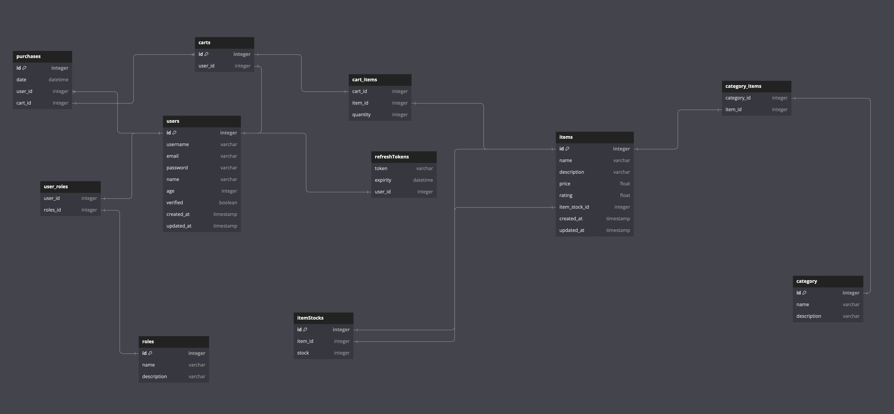

# E-Commerce Portfolio Project

## Table of Contents

- [This is a back-end nodejs project for an e-commerce website.](#this-is-a-back-end-nodejs-project-for-an-e-commerce-website)
- [Current stage](#current-stage)
- [Database](#database-schema)
- [Project annotations](#project-annotations)
- [Useful Links](#usefull-links)

## This is a back-end nodejs project for an e-commerce website.

### Current stage

- __To Do__:
    - [ ]  __Set up checkout endpoint__: Add the logic for handling checkout. There is no need to actually try and charge somebody yet; charging will come in a later evolution of this project. For now, we will assume that all charges succeed for ease of development (still add in error handling to account for times it doesn’t).
    - [ ]  __Set up order endpoint__: Add the logic for handling CRUD operations related to orders.
    - [ ] __Document the API__: Document the API you have built by adding and configuring Swagger to your project.
    - [ ] __Next Steps__: You’re welcome to expand your API beyond these project tasks and get creative! A future portfolio project will build on top of what you have built here, covering tasks for creating the client side of your e-commerce application. If you don’t want to wait that long, you can try building out a client for your API on your own!


- __In Progress__:
    - [ ]  __Set up cart endpoint__: Add the logic for handling CRUD operations related to a user’s cart.

- __Done__:
    - [x]  __Set up user endpoints__: Add the logic for handling CRUD operations related to users and their accounts. (Implementing Refresh Tokens at the moment)
    - [x]  __Set up product endpoints__: Add the logic for handling CRUD operations related to products.
    - [x] __Set up local login__: Add the logic for handling login using a username and password.
    - [x] __Plan API endpoints__: Plan the API endpoints that will be used in retrieving data from your database.
    - [x] __Set up user registration__: Add the logic for handling registration of new users.
    - [x] __Connect the app and database__: Set up your application to be able to interface with the PostgreSQL database.
    - [x] __Create PostgreSQL database and tables__: Create a PostgreSQL database and add the tables from your design.
    - [x] __Design the database__: Plan out the different types of data the application will track and how those pieces of data relate.
    - [x] __Set up an Express server__: Create a directory for your project and set up a basic Express server.
    - [x] __Set up version control__: Set up Git tracking in your directory and make sure to add and commit changes as you make them.
    

### Docker Command

__First time ? Run Docker compose Build__

```shell
docker-compose up --build 
```

__Next time just run this:__

```shell
docker-compose up -d
```

# Database Schema 

Using [dbdiagram](https://dbdiagram.io/)



```dbml
Table users {
  id integer [primary key]
  username varchar
  email varchar
  password varchar
  name varchar
  age integer
  verified boolean
  created_at timestamp
  updated_at timestamp
}

Table refreshTokens {
  token varchar
  expirity datetime
  user_id integer [ref: - users.id] 
}

Table roles {
  id integer [pk]
  name varchar
  description varchar
}

Table user_roles {
  user_id integer [ref: - users.id]
  roles_id integer [ref: - roles.id]
}

Table carts {
  id integer [pk]
  user_id integer unique [ref: - users.id]
}

Table cart_items {
  cart_id integer  [ref: - carts.id]
  item_id integer [ref: - items.id]
  quantity integer
}


Table category {
  id integer [pk]
  name varchar
  description varchar
}

Table items {
  id integer [pk]
  name varchar
  description varchar
  price float
  rating float
  item_stock_id integer [ref: - itemStocks.id]
  created_at timestamp
  updated_at timestamp
}

Table category_items {
  category_id integer [ref: - category.id]
  item_id integer [ref: - items.id]
}

Table purchases {
  id integer [pk]
  date datetime 
  user_id integer [ref: > users.id]
  cart_id integer [ref: < carts.id]
}

Table itemStocks {
  id integer [pk]
  item_id integer [ref: - items.id]
  stock integer

}
```

__Generated PostgresSQL Schema:__

```sql
CREATE TABLE "users" (
  "id" integer PRIMARY KEY,
  "username" varchar,
  "email" varchar,
  "password" varchar,
  "name" varchar,
  "age" integer,
  "verified" boolean,
  "created_at" timestamp,
  "updated_at" timestamp
);

CREATE TABLE "refreshTokens" (
  "token" varchar,
  "expirity" datetime,
  "user_id" integer
);

CREATE TABLE "roles" (
  "id" integer PRIMARY KEY,
  "name" varchar,
  "description" varchar
);

CREATE TABLE "user_roles" (
  "user_id" integer,
  "roles_id" integer
);

CREATE TABLE "carts" (
  "id" integer PRIMARY KEY,
  "quantity" integer,
  "user_id" integer UNIQUE
);

CREATE TABLE "cart_items" (
  "cart_id" integer,
  "item_id" integer
);

CREATE TABLE "category" (
  "id" integer PRIMARY KEY,
  "name" varchar,
  "description" varchar
);

CREATE TABLE "items" (
  "id" integer PRIMARY KEY,
  "name" varchar,
  "description" varchar,
  "price" float,
  "rating" float,
  "item_stock_id" integer,
  "created_at" timestamp,
  "updated_at" timestamp
);

CREATE TABLE "category_items" (
  "category_id" integer,
  "item_id" integer
);

CREATE TABLE "purchases" (
  "id" integer PRIMARY KEY,
  "date" datetime,
  "user_id" integer
);

CREATE TABLE "itemStocks" (
  "id" integer PRIMARY KEY,
  "item_id" integer,
  "stock" integer
);

CREATE TABLE "purchase_items" (
  "purchase_id" integer,
  "item_id" integer
);

ALTER TABLE "refreshTokens" ADD FOREIGN KEY ("user_id") REFERENCES "users" ("id");

ALTER TABLE "user_roles" ADD FOREIGN KEY ("user_id") REFERENCES "users" ("id");

ALTER TABLE "user_roles" ADD FOREIGN KEY ("roles_id") REFERENCES "roles" ("id");

ALTER TABLE "carts" ADD FOREIGN KEY ("user_id") REFERENCES "users" ("id");

ALTER TABLE "cart_items" ADD FOREIGN KEY ("cart_id") REFERENCES "carts" ("id");

ALTER TABLE "cart_items" ADD FOREIGN KEY ("item_id") REFERENCES "items" ("id");

ALTER TABLE "items" ADD FOREIGN KEY ("item_stock_id") REFERENCES "itemStocks" ("id");

ALTER TABLE "category_items" ADD FOREIGN KEY ("category_id") REFERENCES "category" ("id");

ALTER TABLE "category_items" ADD FOREIGN KEY ("item_id") REFERENCES "items" ("id");

ALTER TABLE "purchases" ADD FOREIGN KEY ("user_id") REFERENCES "users" ("id");

ALTER TABLE "itemStocks" ADD FOREIGN KEY ("item_id") REFERENCES "items" ("id");

ALTER TABLE "purchase_items" ADD FOREIGN KEY ("purchase_id") REFERENCES "purchases" ("id");

ALTER TABLE "purchase_items" ADD FOREIGN KEY ("item_id") REFERENCES "items" ("id");

```

*Note you should store your ``.env`` file in the root of the project*

__Enviroment Setup Template__

```sh
NODE_ENV=
PORT=   
DB_HOST=
DB_NAME=
DB_TEST=
DB_PASSWORD=
DB_USER=
DB_DRIVER=
JWT_SECRET=
REFRESH_SECRET=
JWT_EXPIRATION=
JWT_REFRESH_EXPIRATION=
JWT_VALIDATION_EXPIRATION=

SUPER_USER_USERNAME=
SUPER_USER_PASSWORD=
SUPER_USER_EMAIL=
SUPER_USER_FIRST_NAME=
SUPER_USER_LAST_NAME=
SUPER_USER_AGE=
```

# Project annotations

In this project I'm setting up an express with Typescript, I opted for a ORM to integrate the app with the database.

__Currently List:__
- Docker container that contains the app itself 
- PostgreSQL server-less database [Neon Tech](https://neon.tech/)
- Created 2 seperate databases, one for production, another for testing 
- [Sequelize Typescript v6](https://sequelize.org/docs/v6/other-topics/typescript/)
- Jsonwebtokens [Jwt](https://jwt.io/) for authentication
- [Passport](https://www.passportjs.org/) Jwt Strategy for Authentication, may add OAuth later
- [Jest](https://jestjs.io/) and [Supertest](https://www.npmjs.com/package/supertest) for unit and integration tests TDD

*Note I'm defining 2 passport strategies, passport local for signin and register and jwt strategy to verify protected routes that require authentication*

# Usefull Links

- [Passport JWT and Session Authentication Tutorial](https://www.fullstackfoundations.com/blog/passport-jwt)
- [Express Caching](https://medium.com/@muhammadtaifkhan/cache-your-express-nodejs-api-1e9f80b87c88)

# Things to rework

- [ ] Rework process.env right now alot of repetive, may create config folder that exports all env variables to get consumed by the whole project, jwt and db to be percise
